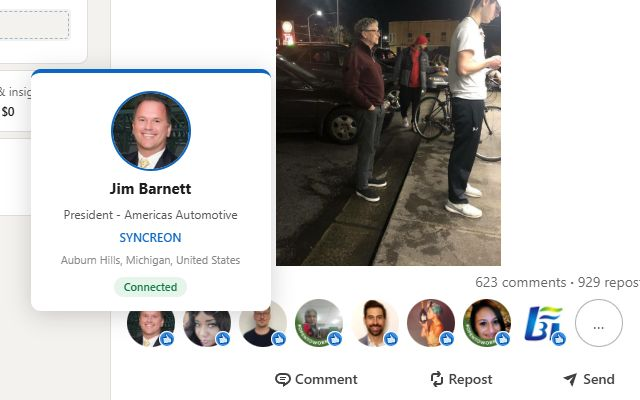

---
title: "LinkedIn Extension v1"
date: 2026-04-22
description: "A browser extension that restores LinkedIn profile hover cards."
draft: false
repo: https://github.com/deckmasterbeam/linkedInExtension
projectTag: linkedInExtension
---

Sometimes when I'm scrolling through LinkedIn, I'll see tags on posts that say something like "X person liked this post". In this format, the profile pic is so small and sometimes the person's name eludes me. When this happens, I have no idea who this person is unless I click through to their profile. 

I ask myself, why doesn't LinkedIn show some kind of expanded info on a person without me needing to click through to their profile? LinkedIn used to show profile pop-ups for users and companies at some point before and after 2017. This feature responds exactly to the problem statement I describe above:

https://www.linkedin.com/blog/member/product/tuesday-tip-hover-over-people-and-companies-in-your-feed

But, evidently, they've cut this feature today. So, I build a browser extension to do just that:

https://github.com/deckmasterbeam/linkedInExtension

(I'm working on getting this published to the Chrome web store, but that takes a while. Non-store installation instructions and privacy policy are in the repo)

I was really curious with this project to do two things: build a browser extension and try to play around with what I perceive to be wasteful practices around network requests. 

First, a lot of my ideas I have for projects are just fixes for websites that I use frequently, fixes that could be powered by an extension. 

Second, I think engineers don't try to optimize their network requests for near-static data enough. Network bandwidth is taken for granted. Your name, profile pic, title, pronouns, and whether you're connected to someone are near static values. Because of that, I decided to just cache these values. With this extension, if you hover over someone, that data will sit in a browser cache for 7 days or until you manually clear it.

Right now, this extension only works on user profiles. If people are interested, I plan to add support for companies too
