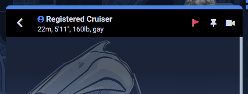
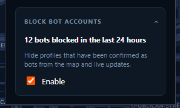

import GithubSnippet from "../../components/GithubSnippet.astro";
import SniffiesInstallInstructions from "../../components/ui/SniffiesInstallInstructions.astro";
import SniffiesPrivacyPolicy from "../../components/ui/SniffiesPrivacyPolicy.astro";

# Sniffies Bot Reporting/Filtering

## What's new?

In this release post, I will be discussing new functionality I've built that will allow you to report bot accounts, allow me to process user reports, and allow your client to receive bot reports and prevent you from seeing any confirmed bot accounts.

## Why is this important?

Sniffies users will be familiar with two major kinds of bots:

1. Bots that send you a message asking you to visit a URL (these URLs always redirect to malware)

2. Profiles that are seemingly always online with some very attractive stats, saying they only meet up with people who subscribe to their OnlyFans

These bots are not the biggest problem in the world, but they are a pain point in the Sniffies user experience. Fortunately, it is possible to do something about these bots that doesn't involve waiting for Sniffies to take action.

## Why is this post different?

In addition to talking about how the user will engage with this feature, I also want to talk about how this feature works from a technical perspective. You can skip to section [How do I use this feature?](#how-do-i-use-this-feature) if this discussion does not interest you, I will not judge.

## Reports

Through developing this extension, I've already explored injecting content into the Sniffies DOM (Document Object Model, the structure of how elements in a website behave). The main entry point of the userscript is a button that gets injected on the Sniffies page load.

This change adds a report button to the top of every profile. Every time you click on a new profile, a report button gets injected. An interesting consideration for this injection is accounting for how the profile animates in when a user icon is clicked. When this extension registers that a user icon has been clicked on, it knows a profile will be entering view, but it doesn't know exactly when that profile is in view. This function deals with that problem by attempting to inject the report button multiple times in quick succession.

<GithubSnippet url="https://github.com/deckmasterbeam/SniffiesProjects/blob/botReports/core/src/report-button-hook.ts#L185-L202" />

When you come across a profile you suspect of being a bot, clicking on this button will bring up a modal that allows you to report the profile. You can enter a reason for your report. When you submit your report, it gets sent and stored to a pending reports database table for me to review.

## The database: reports to client-side enforcement

Reports initially enter a table called `pending_reports`, defined as so:

<GithubSnippet url="https://github.com/deckmasterbeam/SniffiesProjects/blob/botReports/server/schema.sql#L46-L67" />

I considered: what if multiple users report the same account? I do not want to have to sanitize the table every time I validate a reported profile. It would be time-consuming to have to deal with every other report for the same bot account. Instead, I decided to consolidate reports for the same account into a single row in the `pending_reports` table. This is done by using a unique constraint on the `(reported_user_id, report_type)` pair (right now, the only report type is "bot"). When a new report comes in, if this is the first time this profile has ever been reported, a new row will be inserted into the `pending_reports` table. If this is not the first time, the existing row will be updated with the new reporter's ID and message.

From there, I have to take action to validate a report. If I can validate that the profile is a bot, I mark the `status` of the report as "validated" in the `pending_reports` table. Then, I copy the report to `validated_reports`. The bot report is generated from the data in the `validated_reports` table.

<GithubSnippet url="https://github.com/deckmasterbeam/SniffiesProjects/blob/botReports/server/schema.sql#L69-L78" />

I also considered: what if a user is maliciously reporting a profile? I created a `blocked_reporters` table that will contain a list of malicious or annoying reporters. If a report comes in from a reporter on this list, the report will be silently dropped and not stored in the `pending_reports` table.

<GithubSnippet url="https://github.com/deckmasterbeam/SniffiesProjects/blob/botReports/server/schema.sql#L38-L44" />

## Intercepting requests

Here, all Sniffies requests pass through this function to determine if we need to sniff out any bot accounts from the data the client is receiving:

<GithubSnippet url="https://github.com/deckmasterbeam/SniffiesProjects/blob/botReports/core/src/bot-block-hook.ts#L183-L197" />

The first case is on map initialization. The client sends a request to `https://sniffies.com/api/user/init`. The response from this request contains a list of profiles that will initially show up on the map. In order to filter out bots that would show up on that initial map load, we need to check this data for any bot accounts and filter them out.

<GithubSnippet url="https://github.com/deckmasterbeam/SniffiesProjects/blob/botReports/core/src/bot-block-hook.ts#L98-L117" />

The second case is on chat initialization. The client sends a request to `https://sniffies.com/api/v2/post-authentication/chat-data`. The response from this request contains your first page of chat messages. In order to filter out bots that would show up on that initial chat load, we need to check this data for any bot accounts and filter them out.

<GithubSnippet url="https://github.com/deckmasterbeam/SniffiesProjects/blob/botReports/core/src/bot-block-hook.ts#L120-L157" />

The third case is on a chat thread opening. The client sends a request to `https://sniffies.com/api/messages`. The response from this request contains your first page of messages for that chat thread. Technically, because of the chat filtering (and the WebSocket stuff we'll talk about next), this request should never get hit for a bot account. But, it's appropriately defensive to guard this path too.

<GithubSnippet url="https://github.com/deckmasterbeam/SniffiesProjects/blob/botReports/core/src/bot-block-hook.ts#L160-L181" />

In addition to request interception, we also need to intercept WebSocket messages. The Sniffies client uses WebSockets to receive real-time updates about new messages, new conversations, and other events. We need to intercept these WebSocket messages to filter out any bot accounts that may be sending messages or participating in conversations.

<GithubSnippet url="https://github.com/deckmasterbeam/SniffiesProjects/blob/botReports/core/src/bot-block-hook.ts#L205-L247" />

## How does the client know what to filter?

On initialization, the client will send a request to `https://sniffies.com/api/blocked-bots` to get a list of all validated bot accounts. This list is cached for 24 hours, so the client will only send this request once per day. The client will then use this list to filter out any bot accounts from the data it receives from Sniffies.

## Client-side filter-count tracking

I think this feature represents an important value to Sniffies users. But, how do I communicate value when success for this feature is the absence of something? I decided to add a counter to the popup that shows how many distinct bot accounts have been filtered out in the last 24 hours. This stat is updated in real-time as new bot accounts are filtered out.

## How do I use this feature?

Open the "Block Bot Accounts" section and click "Enable". As users create more reports, the user experience of a bot-free Sniffies will improve. If you come across a bot account, click the report button and submit a report. If/when I validate the report, that bot account will be filtered out for all users who have this feature enabled. Continue down to the installation instructions to set up this version of the extension.

<SniffiesInstallInstructions version="0.3" />

<SniffiesPrivacyPolicy />
